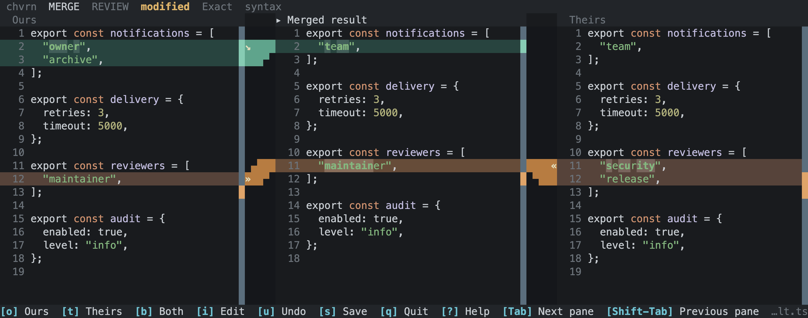

# Chvrn

**Editable diffs, three-way merges and Git review in your terminal.**

[](docs/assets/merge-terminal-capture.png)

*Rendered terminal output. [Capture details.](docs/demo.md)*

- **Compare and edit.** Two editable panes, connected changes and syntax highlighting.
- **Resolve merges.** Choose either side, keep both or edit the result, with undo/redo.
- **Review Git changes.** Inspect your worktree, stage hunks and use Git's diff and merge tools.

## Install

Requires stable Rust and Git.

```sh
cargo install --locked --git https://github.com/stuplum/chvrn.git chvrn-cli
```

Run `chvrn` inside a Git repository to start reviewing. Press `?` for help.

## Documentation

[User guide](docs/usage.md) · [Integrations](docs/integrations.md) · [Development](docs/development.md)

## Status

Early development. Tested interactively on macOS arm64. [Current limitations.](docs/usage.md#safety-and-current-limitations)

## Licence

[GPLv3 only](LICENSE). Copyright (c) 2026 Stuart Plumbley.
